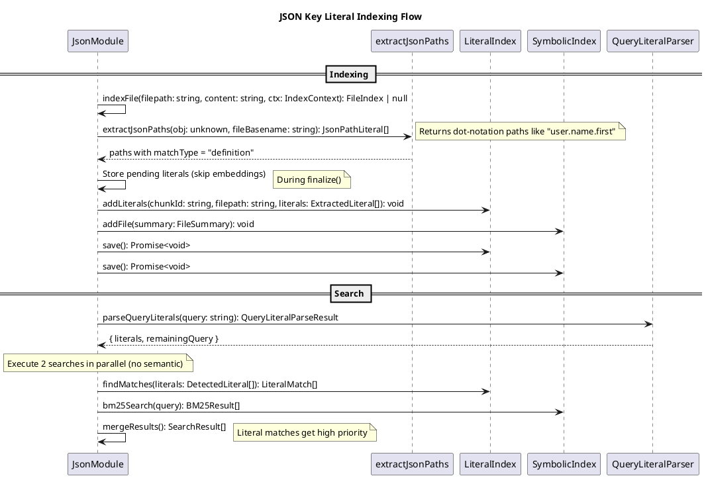

# JSON Key Literal Indexing Codemap

## Description

Optimizes JSON file indexing by extracting dot-notation key paths as literals instead of using expensive embedding generation. JSON files are indexed by their structure (key paths) rather than content, enabling fast exact-match searches like `user.name.first` for keys nested in JSON files.

**Key changes:**

1. Extract full dot-notation paths from JSON objects (e.g., `name.first` → `user.name.first` when in `user.json`)
2. Index paths as literals using existing `LiteralIndex` infrastructure
3. Skip embedding generation for JSON files (literal-only search mode)
4. Search uses literal matching for exact key path matches + BM25 for fuzzy matching

## Sequence Diagram



## Files

### Domain Layer

#### Entities

- `src/domain/entities/literal.ts` - **NO CHANGE** - Reuse existing literal types
  - `ExtractedLiteral` - Used for JSON paths
  - `LiteralType = "identifier"` - JSON paths use "identifier" type
  - `LiteralMatchType = "definition"` - JSON keys are definitions

#### Services

- `src/domain/services/jsonPathExtractor.ts` - **NEW** - Extract dot-notation paths from JSON

  - `extractJsonPaths(obj: unknown, fileBasename: string): JsonPathLiteral[]`
  - Recursively traverses JSON structure
  - Prefixes all paths with filename (without extension)
  - Returns array of full dot-notation paths

- `src/domain/services/jsonPathExtractor.test.ts` - **NEW** - Tests for path extraction

  - Simple objects
  - Nested objects
  - Arrays (indexed paths)
  - Edge cases (empty objects, null values)

- `src/domain/services/index.ts` - **MODIFY** - Re-export new functions

### Infrastructure Layer

- `src/infrastructure/storage/literalIndex.ts` - **NO CHANGE** - Reuse existing infrastructure

### Module Layer

- `src/modules/data/json/index.ts` - **MODIFY** - Integrate literal-based indexing

  - Remove embedding generation (skip `getEmbeddings` call)
  - Add literal extraction using `extractJsonPaths`
  - Add `LiteralIndex` initialization and finalization
  - Update `search()` to use literal index + BM25 (no semantic search)
  - Simplify to single-chunk-per-file approach for literals

## Contracts

### JsonPathLiteral (extends ExtractedLiteral)

```typescript
/**
 * A literal extracted from a JSON file representing a dot-notation path.
 * Example: For user.json containing { name: { first: "john" } }
 * This would produce "user.name.first"
 */
export interface JsonPathLiteral {
  /** The full dot-notation path including filename prefix */
  value: string; // e.g., "user.name.first"

  /** Always "identifier" for JSON paths */
  type: "identifier";

  /** Always "definition" - JSON keys define structure */
  matchType: "definition";
}
```

### extractJsonPaths Function

```typescript
/**
 * Extract all key paths from a JSON object as literals.
 * Prefixes all paths with the filename (without extension).
 *
 * @param obj - Parsed JSON object
 * @param fileBasename - Filename without extension (e.g., "user" from "user.json")
 * @returns Array of literals representing all dot-notation paths
 *
 * @example
 * // user.json: { name: { first: "john" } }
 * extractJsonPaths({ name: { first: "john" } }, "user")
 * // Returns: [
 * //   { value: "user.name", type: "identifier", matchType: "definition" },
 * //   { value: "user.name.first", type: "identifier", matchType: "definition" }
 * // ]
 */
export function extractJsonPaths(
  obj: unknown,
  fileBasename: string
): ExtractedLiteral[];
```

### Updated JsonModuleData

```typescript
/**
 * Module-specific data stored alongside file index.
 * Note: embeddings are now optional (not generated for literal-only mode)
 */
export interface JsonModuleData {
  /** JSON paths extracted from the file */
  jsonPaths: string[];

  /** Optional - only if embeddings are enabled */
  embeddings?: number[][];
  embeddingModel?: string;

  [key: string]: unknown;
}
```

### Updated JsonModule Search

The search method changes from hybrid (semantic + BM25) to literal + BM25:

```typescript
async search(
  query: string,
  ctx: SearchContext,
  options: SearchOptions = {}
): Promise<SearchResult[]> {
  // 1. Parse query for literals
  const { literals: queryLiterals, remainingQuery } = parseQueryLiterals(query);

  // 2. Load literal index
  const literalIndex = new LiteralIndex(indexDir, this.id);
  await literalIndex.initialize();
  const literalMatchMap = literalIndex.buildMatchMap(queryLiterals);

  // 3. BM25 search on keywords
  const bm25Results = bm25Index.search(query, topK * 3);

  // 4. Score and merge results
  // - Literal matches get base score + multiplier
  // - BM25-only results use normalized score
  // - No semantic scoring (embeddings not used)

  return results;
}
```

## Integration Points

### 1. Index Time (JsonModule.indexFile)

```typescript
// Parse JSON and extract paths
const parsed = JSON.parse(content);
const fileBasename = path.basename(filepath, path.extname(filepath));
const jsonPaths = extractJsonPaths(parsed, fileBasename);

// Create single chunk for the file (simplified)
const chunks: Chunk[] = [
  {
    id: generateChunkId(filepath, 1, lineCount),
    content: content,
    startLine: 1,
    endLine: lineCount,
    type: "file",
  },
];

// Store literals for finalize (NO embeddings generated)
const literals: ExtractedLiteral[] = jsonPaths;
this.pendingLiterals.set(chunk.id, { filepath, literals });

// Module data without embeddings
const moduleData: JsonModuleData = {
  jsonPaths: jsonPaths.map((l) => l.value),
};
```

### 2. Finalize (JsonModule.finalize)

```typescript
// Initialize and build literal index (same as TypeScript module)
this.literalIndex = new LiteralIndex(indexDir, this.id);
await this.literalIndex.initialize();

// Remove old literals and add new ones
for (const filepath of indexedFilepaths) {
  this.literalIndex.removeFile(filepath);
}

for (const [chunkId, { filepath, literals }] of this.pendingLiterals) {
  this.literalIndex.addLiterals(chunkId, filepath, literals);
}

await this.literalIndex.save();
```

### 3. Search Time (JsonModule.search)

```typescript
// Literal-first search with BM25 fallback
const literalMatches = literalIndex.findMatches(queryLiterals);

// Score with literal priority
for (const match of literalMatches) {
  const score =
    LITERAL_SCORING.BASE_SCORE *
    LITERAL_SCORING.MULTIPLIERS[match.indexedLiteral.matchType][confidence];
  // Add BM25 component if available
}
```

## Path Extraction Examples

### Simple Object

```json
// config.json
{
  "port": 3000,
  "host": "localhost"
}
```

Extracted paths:

- `config.port`
- `config.host`

### Nested Object

```json
// user.json
{
  "name": {
    "first": "john",
    "last": "doe"
  },
  "email": "john@example.com"
}
```

Extracted paths:

- `user.name`
- `user.name.first`
- `user.name.last`
- `user.email`

### Array with Objects

```json
// users.json
{
  "users": [
    { "id": 1, "name": "Alice" },
    { "id": 2, "name": "Bob" }
  ]
}
```

Extracted paths:

- `users.users`
- `users.users[0]`
- `users.users[0].id`
- `users.users[0].name`
- `users.users[1]`
- `users.users[1].id`
- `users.users[1].name`

**Note:** Array indexing paths are included but may be less useful for search. Consider an option to skip indexed paths.

### Deeply Nested

```json
// settings.json
{
  "database": {
    "connection": {
      "host": "localhost",
      "port": 5432
    }
  }
}
```

Extracted paths:

- `settings.database`
- `settings.database.connection`
- `settings.database.connection.host`
- `settings.database.connection.port`

## Performance Improvements

| Before                                      | After                                       |
| ------------------------------------------- | ------------------------------------------- |
| ~500ms per JSON file (embedding generation) | ~5ms per JSON file (path extraction only)   |
| 50-line chunks with embeddings              | Single file chunk with literal paths        |
| Hybrid search (semantic 70% + BM25 30%)     | Literal + BM25 search (no embedding lookup) |

## Notes

1. **No embedding generation**: JSON files use literal-only indexing, dramatically reducing index time
2. **Filename prefix**: All paths include filename (e.g., `package.dependencies.react`) for disambiguation
3. **Definition-only**: JSON keys are always "definition" type (they define the structure)
4. **BM25 fallback**: Keywords from keys and values still feed BM25 for fuzzy matching
5. **Backward compatible**: Files indexed with old format will work with reduced functionality
6. **Query patterns**: Users can search with backticks for exact matches: `` `user.name.first` ``
