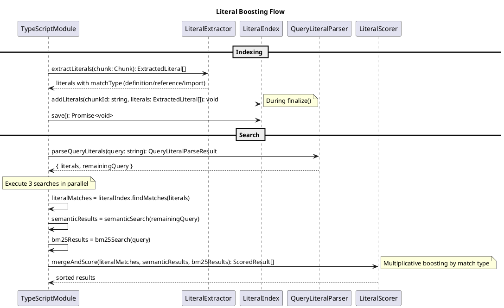

# Literal Boosting Codemap

## Description

Literal Boosting improves search precision by preserving and prioritizing exact-match terms during code search. It extracts code identifiers (class names, function names, etc.) during indexing, detects literals in queries (explicit via backticks, implicit via casing patterns), and applies multiplicative score boosts when exact matches are found.

## Sequence Diagram



## Files

### Domain Layer

#### Entities

- `src/domain/entities/literal.ts` - **NEW** - Literal type definitions
  - `LiteralType` - className, functionName, etc.
  - `LiteralMatchType` - definition, reference, import
  - `ExtractedLiteral` - Literal extracted from code
  - `DetectedLiteral` - Literal detected in query
  - `LiteralMatch` - Match between query and indexed literal

#### Services

- `src/domain/services/queryLiteralParser.ts` - **NEW** - Query parsing with tests

  - `parseQueryLiterals(query: string): QueryLiteralParseResult`
  - Handles explicit (backticks) and implicit (casing) detection
  - Returns literals + remaining query for semantic search

- `src/domain/services/queryLiteralParser.test.ts` - **NEW** - Comprehensive tests

  - Explicit backtick detection
  - Implicit casing pattern detection (PascalCase, camelCase, etc.)
  - Edge cases and mixed queries

- `src/domain/services/literalExtractor.ts` - **NEW** - Extract literals from chunks

  - `extractLiterals(chunk: Chunk): ExtractedLiteral[]`
  - Determines match type (definition vs reference)

- `src/domain/services/literalScorer.ts` - **NEW** - Multiplicative scoring
  - `calculateLiteralMultiplier(matchType, confidence): number`
  - `mergeAndScore(...)` - Combine three search sources

#### Index Updates

- `src/domain/entities/index.ts` - **MODIFY** - Re-export literal types
- `src/domain/services/index.ts` - **MODIFY** - Re-export literal functions

### Infrastructure Layer

#### Storage

- `src/infrastructure/storage/literalIndex.ts` - **NEW** - Literal index I/O

  - `LiteralIndex` class - Manages literal storage and lookup
  - `save(): Promise<void>` - Persist to disk
  - `load(): Promise<void>` - Load from disk
  - `addLiterals(chunkId: string, filepath: string, literals: ExtractedLiteral[]): void`
  - `findMatches(literals: DetectedLiteral[]): LiteralMatch[]` - Returns matches with filepath
  - `buildMatchMap(literals: DetectedLiteral[]): Map<string, LiteralMatch[]>` - Convenience for search

- `src/infrastructure/storage/index.ts` - **MODIFY** - Re-export LiteralIndex

### Module Layer

- `src/modules/language/typescript/index.ts` - **MODIFY** - Integrate literal boosting
  - Add literal extraction in `indexFile()`
  - Add literal index initialization in `initialize()` / `finalize()`
  - Update `search()` to use three-source merge with multiplicative scoring

## Contracts

### Literal Types

```typescript
/**
 * Types of literals that can be extracted from code.
 */
export type LiteralType =
  | "className"
  | "functionName"
  | "variableName"
  | "interfaceName"
  | "typeName"
  | "enumName"
  | "packageName"
  | "identifier";

/**
 * How the chunk relates to the literal.
 */
export type LiteralMatchType =
  | "definition" // Chunk IS the literal (class AuthService {})
  | "reference" // Chunk USES the literal (new AuthService())
  | "import"; // Chunk imports the literal

/**
 * A literal extracted from indexed code.
 */
export interface ExtractedLiteral {
  /** The exact term as it appears in code */
  value: string;

  /** Type classification */
  type: LiteralType;

  /** How this chunk relates to the literal */
  matchType: LiteralMatchType;
}

/**
 * A literal detected in a search query.
 */
export interface DetectedLiteral {
  /** The literal value (without backticks) */
  value: string;

  /** Original as it appeared in query */
  rawValue: string;

  /** Detection confidence */
  confidence: "high" | "medium" | "low";

  /** How the literal was detected */
  detectionMethod: "explicit-backtick" | "explicit-quote" | "implicit-casing";

  /** Inferred type based on pattern */
  inferredType?: LiteralType;
}

/**
 * Result of parsing a query for literals.
 */
export interface QueryLiteralParseResult {
  /** Detected literals */
  literals: DetectedLiteral[];

  /** Query with literals removed (for semantic search) */
  remainingQuery: string;
}

/**
 * A match between a query literal and an indexed literal.
 */
export interface LiteralMatch {
  /** The query literal that was matched */
  queryLiteral: DetectedLiteral;

  /** The indexed literal it matched */
  indexedLiteral: ExtractedLiteral;

  /** ID of the chunk containing this literal */
  chunkId: string;

  /** Filepath of the file containing the chunk */
  filepath: string;

  /** Whether the match is exact (case-sensitive) */
  exactMatch: boolean;
}
```

### Literal Index Storage Format

Stored at: `.raggrep/index/<module>/literals/_index.json`

```typescript
interface LiteralIndexData {
  /** Schema version */
  version: string;

  /** Map from literal value (lowercase) → entries */
  entries: Record<
    string,
    Array<{
      chunkId: string;
      filepath: string; // Enables literal-only retrieval
      originalCasing: string;
      type: LiteralType;
      matchType: LiteralMatchType;
    }>
  >;
}
```

### Scoring Constants

```typescript
/** Base score for chunks found only via literal index */
const LITERAL_BASE_SCORE = 0.5;

/** Multipliers by match type and confidence */
const LITERAL_MULTIPLIERS: Record<
  LiteralMatchType,
  Record<"high" | "medium" | "low", number>
> = {
  definition: { high: 2.5, medium: 2.0, low: 1.5 },
  reference: { high: 2.0, medium: 1.5, low: 1.3 },
  import: { high: 1.5, medium: 1.3, low: 1.1 },
};
```

### Integration with SearchResult

The `context` field in `SearchResult` will include:

```typescript
context: {
  semanticScore: number;
  bm25Score: number;
  pathBoost: number;
  fileTypeBoost: number;
  chunkTypeBoost: number;
  exportBoost: number;
  // NEW fields
  literalMultiplier: number;
  literalMatchType?: LiteralMatchType;
  literalConfidence?: "high" | "medium" | "low";
}
```

## Integration Points

### 1. Index Time (TypeScriptModule.indexFile)

```typescript
// After parsing chunks
const chunks: Chunk[] = parsedChunks.map((pc) => ({...}));

// Extract literals from each chunk (includes matchType)
for (const chunk of chunks) {
  const literals = extractLiterals(chunk);
  this.literalIndex.addLiterals(chunk.id, literals);
}
```

### 2. Finalize (TypeScriptModule.finalize)

```typescript
// After saving symbolic index
await this.literalIndex.save();
```

### 3. Search Time (TypeScriptModule.search)

```typescript
// 1. Parse query for literals
const { literals: queryLiterals, remainingQuery } = parseQueryLiterals(query);

// 2. Execute three searches
const literalMatches = this.literalIndex.findMatches(queryLiterals);
// semanticSearch uses remainingQuery
// bm25Search uses full query

// 3. Build match map for scoring
const literalMatchMap = new Map<string, LiteralMatch[]>();
for (const match of literalMatches) {
  const matches = literalMatchMap.get(match.chunkId) || [];
  matches.push(match);
  literalMatchMap.set(match.chunkId, matches);
}

// 4. Score with multiplicative boosting
for (const { filepath, chunk, embedding } of allChunksData) {
  const semanticScore = cosineSimilarity(queryEmbedding, embedding);
  const bm25Score = bm25Scores.get(chunk.id) || 0;

  // Base hybrid score
  let score = SEMANTIC_WEIGHT * semanticScore + BM25_WEIGHT * bm25Score;

  // Apply literal multiplier
  const matches = literalMatchMap.get(chunk.id);
  let literalMultiplier = 1.0;
  if (matches && matches.length > 0) {
    // Use highest multiplier from all matches
    literalMultiplier = Math.max(
      ...matches.map((m) =>
        calculateLiteralMultiplier(
          m.indexedLiteral.matchType,
          m.queryLiteral.confidence
        )
      )
    );
    score *= literalMultiplier;
  }

  // Add other boosts
  score += pathBoost + fileTypeBoost + chunkTypeBoost + exportBoost;

  results.push({
    filepath,
    chunk,
    score,
    moduleId: this.id,
    context: {
      semanticScore,
      bm25Score,
      literalMultiplier,
      // ... other fields
    },
  });
}

// 5. Add literal-only matches (not found by semantic/BM25)
for (const [chunkId, matches] of literalMatchMap) {
  if (!resultsHaveChunk(chunkId)) {
    // Load chunk and add with base score
    const chunk = await loadChunk(chunkId);
    results.push({
      filepath: chunk.filepath,
      chunk,
      score: LITERAL_BASE_SCORE,
      moduleId: this.id,
      context: { literalOnly: true },
    });
  }
}
```

## Query Literal Detection Patterns

### Explicit (High Confidence)

| Pattern   | Regex           | Example                  |
| --------- | --------------- | ------------------------ |
| Backticks | `` `([^`]+)` `` | `` find `AuthService` `` |
| Quotes    | `"([^"]+)"`     | `find "handleLogin"`     |

### Implicit (Medium/Low Confidence)

| Pattern         | Regex                       | Confidence | Example        |
| --------------- | --------------------------- | ---------- | -------------- |
| PascalCase      | `[A-Z][a-z]+([A-Z][a-z]+)+` | Medium     | `AuthService`  |
| camelCase       | `[a-z]+[A-Z][a-zA-Z]*`      | Medium     | `getUserById`  |
| SCREAMING_SNAKE | `[A-Z]+(_[A-Z]+)+`          | Medium     | `MAX_RETRIES`  |
| snake_case      | `[a-z]+(_[a-z]+)+`          | Low        | `user_auth`    |
| kebab-case      | `[a-z]+(-[a-z]+)+`          | Low        | `auth-service` |

## Test Cases for QueryLiteralParser

### Explicit Detection

```typescript
// Backticks
parseQueryLiterals("find the `AuthService` class");
// → { literals: [{ value: "AuthService", confidence: "high", ... }], remainingQuery: "find the  class" }

// Multiple backticks
parseQueryLiterals("`UserService` uses `AuthService`");
// → { literals: [{ value: "UserService", ... }, { value: "AuthService", ... }], ... }

// Quotes
parseQueryLiterals('search for "handleLogin"');
// → { literals: [{ value: "handleLogin", confidence: "high", ... }], ... }
```

### Implicit Detection

```typescript
// PascalCase
parseQueryLiterals("find AuthService");
// → { literals: [{ value: "AuthService", confidence: "medium", inferredType: "className" }], ... }

// camelCase
parseQueryLiterals("where is getUserById defined");
// → { literals: [{ value: "getUserById", confidence: "medium", inferredType: "functionName" }], ... }

// SCREAMING_SNAKE
parseQueryLiterals("what is MAX_RETRIES");
// → { literals: [{ value: "MAX_RETRIES", confidence: "medium", inferredType: "variableName" }], ... }

// Mixed
parseQueryLiterals("find `AuthService` and getUserById");
// → { literals: [
//     { value: "AuthService", confidence: "high", ... },
//     { value: "getUserById", confidence: "medium", ... }
//   ], ... }
```

### Edge Cases

```typescript
// No literals
parseQueryLiterals("find authentication functions");
// → { literals: [], remainingQuery: "find authentication functions" }

// Single word PascalCase (might be false positive)
parseQueryLiterals("find Auth");
// → { literals: [], remainingQuery: "find Auth" } // Too short for implicit

// Nested backticks (take inner)
parseQueryLiterals("find ``Auth``");
// → Handle gracefully
```

## Notes

1. **Performance**: Literal index uses Map lookup - O(1) per literal
2. **Storage**: Includes filepath for literal-only retrieval
3. **Two-path retrieval**: Literal-only matches always surface, even if not found by semantic/BM25
4. **AST-based extraction**: Uses TypeScript AST for accurate identifier extraction
5. **Test-first**: QueryLiteralParser developed with comprehensive tests
6. **Multiplicative**: Boosts without overriding semantic relevance
7. **Extensibility**: Can later add reference extraction, fuzzy matching
