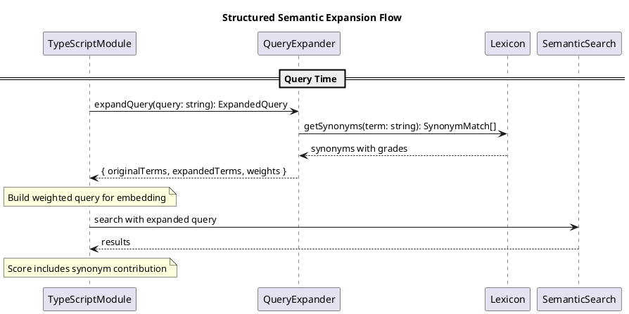

# Structured Semantic Expansion Codemap

## Description

Structured Semantic Expansion (SSE) improves search recall by expanding query terms with domain-specific synonyms. Unlike literal boosting (which preserves exactness), SSE broadens the search surface using a curated lexicon with graded synonym relationships.

## Sequence Diagram



## Files

### Domain Layer

#### Entities

- `src/domain/entities/lexicon.ts` - **NEW** - Lexicon type definitions
  - `SynonymGrade` - "strong" | "moderate" | "weak"
  - `SynonymEntry` - Term with graded synonyms
  - `Lexicon` - Collection of synonym entries
  - `ExpandedTerm` - Term with expansion metadata
  - `ExpandedQuery` - Query with all expanded terms

#### Services

- `src/domain/services/lexicon.ts` - **NEW** - Query expansion logic
  - `DEFAULT_LEXICON` - Built-in programming domain lexicon
  - `expandQuery(query, lexicon?, options?)` - Main expansion function
  - `getSynonyms(term, lexicon)` - Get synonyms for a term
  - `EXPANSION_WEIGHTS` - Weight constants by grade

- `src/domain/services/lexicon.test.ts` - **NEW** - Unit tests
  - Test synonym lookup
  - Test query expansion
  - Test weight application
  - Test expansion depth limiting

#### Index Updates

- `src/domain/entities/index.ts` - **MODIFY** - Re-export lexicon types
- `src/domain/services/index.ts` - **MODIFY** - Re-export expansion functions

### Module Layer

- `src/modules/language/typescript/index.ts` - **MODIFY** - Integrate SSE into search
  - Use expanded query for embedding generation
  - Apply synonym weights to scoring

## Contracts

### Lexicon Types

```typescript
/**
 * Correlation grade for synonyms.
 * Determines how much weight a synonym contributes to scoring.
 */
export type SynonymGrade = "strong" | "moderate" | "weak";

/**
 * A synonym entry in the lexicon.
 */
export interface SynonymEntry {
  /** The canonical term */
  term: string;

  /** Synonyms with their correlation grades */
  synonyms: Array<{
    term: string;
    grade: SynonymGrade;
  }>;

  /** Optional context restriction (e.g., "typescript", "database") */
  context?: string;
}

/**
 * The lexicon containing all synonym mappings.
 */
export interface Lexicon {
  /** Version for compatibility */
  version: string;

  /** All synonym entries */
  entries: SynonymEntry[];

  /** Optional module-specific overrides */
  moduleOverrides?: Record<string, SynonymEntry[]>;
}

/**
 * An expanded term with weight information.
 */
export interface ExpandedTerm {
  /** The term (original or synonym) */
  term: string;

  /** Weight for scoring (1.0 for original, lower for synonyms) */
  weight: number;

  /** How this term was derived */
  source: "original" | "strong" | "moderate" | "weak";

  /** The original term this was expanded from (if synonym) */
  expandedFrom?: string;
}

/**
 * Result of expanding a query.
 */
export interface ExpandedQuery {
  /** Original query terms */
  originalTerms: string[];

  /** All terms including expansions */
  expandedTerms: ExpandedTerm[];

  /** Query string with expansions (for embedding) */
  expandedQueryString: string;
}
```

### Expansion Constants

```typescript
/**
 * Weights applied to synonyms by grade.
 */
export const EXPANSION_WEIGHTS: Record<SynonymGrade, number> = {
  strong: 0.9,
  moderate: 0.6,
  weak: 0.3,
};

/**
 * Default expansion options.
 */
export const DEFAULT_EXPANSION_OPTIONS = {
  /** Maximum expansion depth (passes) */
  maxDepth: 1,

  /** Include weak synonyms */
  includeWeak: true,

  /** Maximum total terms after expansion */
  maxTerms: 20,
};
```

### Default Lexicon (Programming Domain)

```typescript
const DEFAULT_LEXICON: Lexicon = {
  version: "1.0.0",
  entries: [
    // Code structure
    {
      term: "function",
      synonyms: [
        { term: "method", grade: "strong" },
        { term: "handler", grade: "moderate" },
        { term: "callback", grade: "moderate" },
        { term: "procedure", grade: "weak" },
      ],
    },
    {
      term: "class",
      synonyms: [
        { term: "type", grade: "strong" },
        { term: "interface", grade: "moderate" },
        { term: "struct", grade: "moderate" },
        { term: "model", grade: "weak" },
      ],
    },
    // Authentication
    {
      term: "auth",
      synonyms: [
        { term: "authentication", grade: "strong" },
        { term: "authorization", grade: "strong" },
        { term: "login", grade: "moderate" },
        { term: "session", grade: "weak" },
        { term: "security", grade: "weak" },
      ],
    },
    // ... more entries
  ],
};
```

## Integration with Search

### TypeScript Module Changes

```typescript
// In search() method:

// 1. Expand query with synonyms
const expandedQuery = expandQuery(query, DEFAULT_LEXICON, {
  maxDepth: 1,
  includeWeak: true,
});

// 2. Use expanded query for embedding
const queryEmbedding = await getEmbedding(expandedQuery.expandedQueryString);

// 3. Track expansion in result context
results.push({
  // ...
  context: {
    // existing fields...
    synonymsUsed: expandedQuery.expandedTerms
      .filter((t) => t.source !== "original")
      .map((t) => t.term),
  },
});
```

## Test Cases

### Unit Tests (lexicon.test.ts)

```typescript
// Synonym lookup
describe("getSynonyms", () => {
  it("returns synonyms for known term");
  it("returns empty for unknown term");
  it("respects grade filtering");
});

// Query expansion
describe("expandQuery", () => {
  it("expands single term with synonyms");
  it("expands multiple terms");
  it("assigns correct weights");
  it("respects maxDepth option");
  it("respects maxTerms limit");
  it("handles unknown terms gracefully");
});
```

### Integration Tests

```typescript
describe("Semantic Expansion in Search", () => {
  it("should find 'method' when searching for 'function'");
  it("should find 'authentication' when searching for 'auth'");
  it("should rank original term matches higher than synonym matches");
});
```

## Notes

1. **Query-time only**: SSE is applied at search time, not index time
2. **No persistence**: Lexicon is in-memory, loaded at startup
3. **Combinable**: Works alongside literal boosting (multiplicative)
4. **Extensible**: Users can provide custom lexicons in the future
5. **Conservative defaults**: Start with depth=1 to avoid noise
