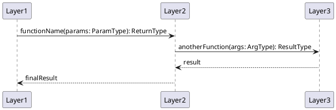

# [Feature Name] Codemap

## Description

Brief explanation of what this feature accomplishes and its purpose.

## Sequence Diagram



## Files

### Domain Layer

#### Entities

- `src/domain/entities/feature.ts` - Entity definitions

#### Services

- `src/domain/services/feature.ts` - Pure algorithms

#### Ports

- `src/domain/ports/feature.ts` - Interface definitions

### Infrastructure Layer

- `src/infrastructure/feature/implementation.ts` - I/O implementations

### Application Layer

- `src/app/feature/index.ts` - Orchestration

## Contracts

### Key Interfaces

```typescript
interface ExampleInterface {
  field: string;
}
```

## Integration Points

1. Where this feature connects to existing code
2. Entry points and exit points

## Notes

Additional context or considerations.
